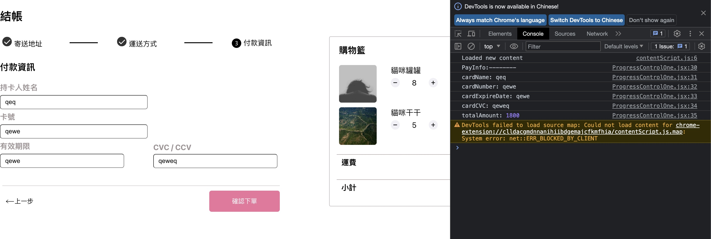

# Alpha Shop IV



This is an web-shop with step control function to show the status of product.

Three parts to show different condition, includes delivery address information, the way of delivery and payment information.

Add part of cart, includes products info, delivery fee and total amount.

console.log can read pay information and cart's total amount.

More function will be expansion.

## Installation

Here are the steps to install and start the server:

1. Clone the repository:

```
    git clone https://github.com/EagleRaySinging/alpha-shop-i
```

2. Install the dependencies and start the server:

```
    cd alpha-shop-i
```

```
    npm install
```

```
    npm start
```

3. Open your browser and navigate to http://localhost:3000
   (If you are not navigated automatically.)

4. You may stop it by typing Ctrl + c anytime

## Development Tools

- react@18.2.0
